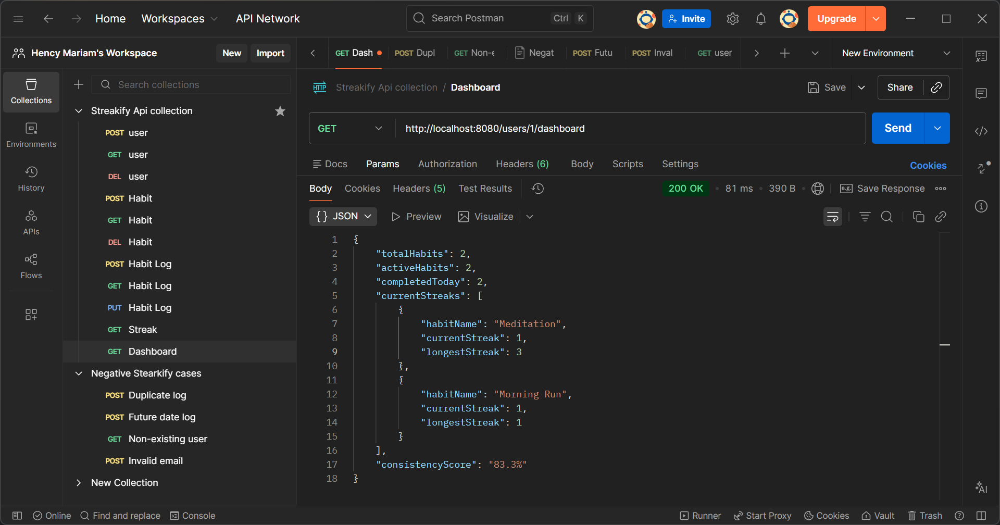
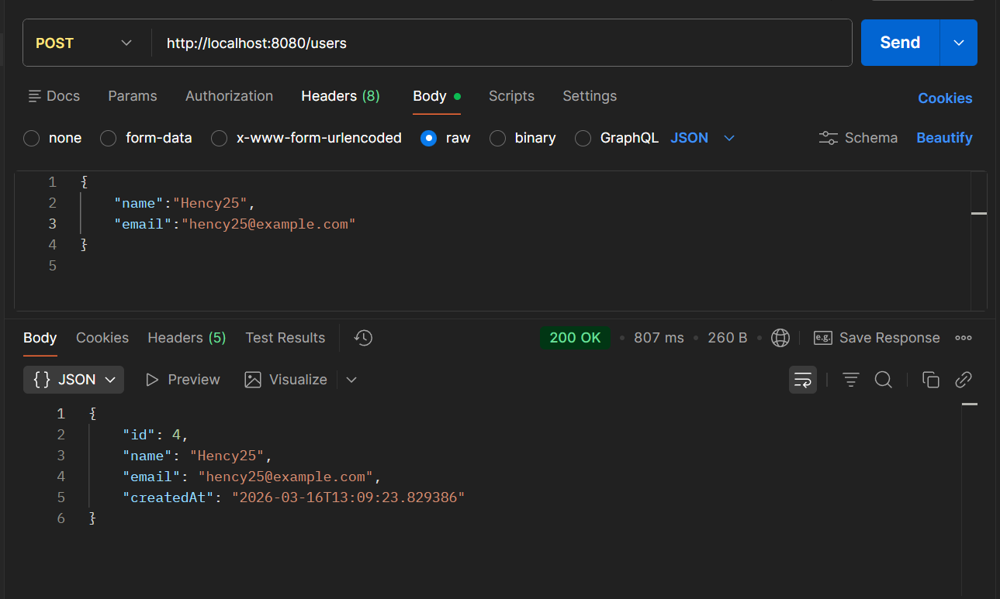
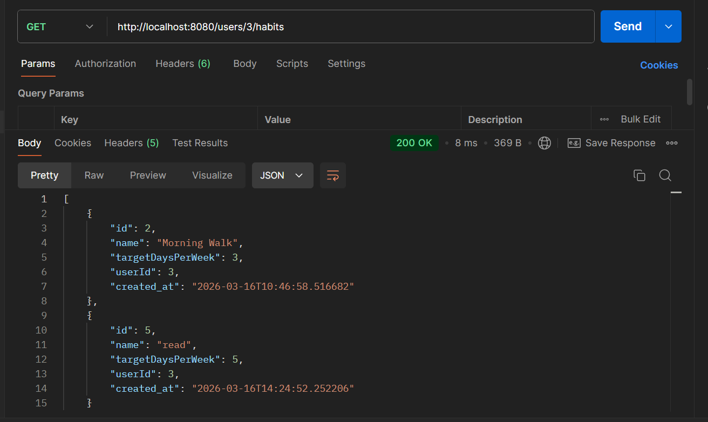
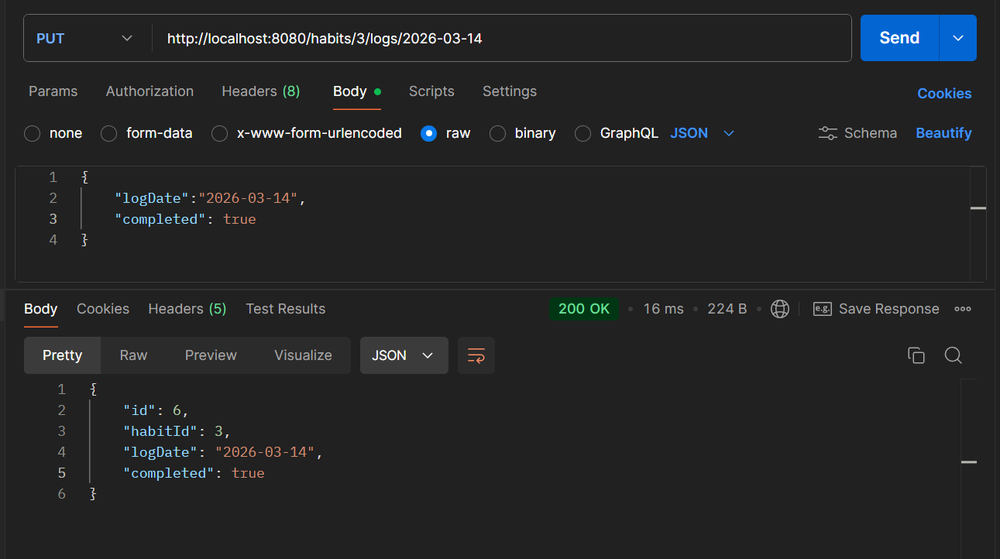
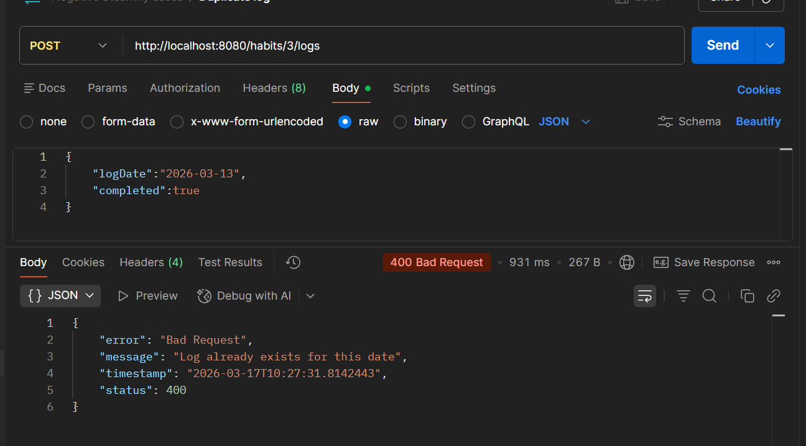
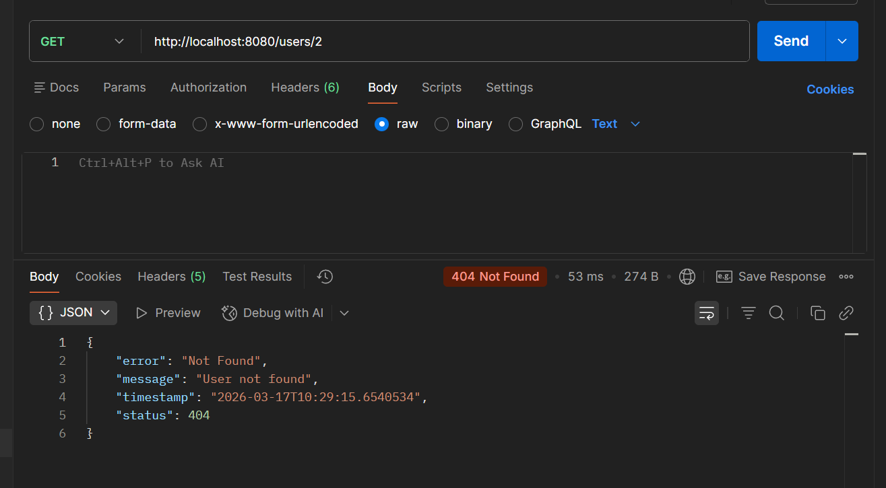

# Streakify

Streakify is a Spring Boot habit-tracking backend API that helps users create habits, log daily progress, and monitor streak consistency.

## Tech Stack

- Java 17
- Spring Boot (Web MVC, Validation, Data JPA)
- PostgreSQL
- Maven Wrapper (`mvnw` / `mvnw.cmd`)

## Setup Steps

### 1. Clone and open project

```bash
git clone https://github.com/25hency/Streakify.git
cd Streakify
```

### 2. Create PostgreSQL database

```sql
CREATE DATABASE streakify_db;
```

### 3. Configure environment variables

The app reads DB credentials from environment variables in `application.properties`:

- `DB_URL` (default: `jdbc:postgresql://localhost:5000/streakify_db`)
- `DB_USERNAME` (default: `postgres`)
- `DB_PASSWORD` (default: empty)

On Windows PowerShell (current session):

```powershell
$env:DB_URL="jdbc:postgresql://localhost:5432/streakify_db"
$env:DB_USERNAME="postgres"
$env:DB_PASSWORD="your_password"
```

### 4. Run the application

Windows:

```powershell
.\mvnw.cmd spring-boot:run
```

macOS/Linux:

```bash
./mvnw spring-boot:run
```

The API starts on:

- `http://localhost:8080`

### 5. Run tests

Windows:

```powershell
.\mvnw.cmd test
```

macOS/Linux:

```bash
./mvnw test
```

## DB Configuration

Configured in `src/main/resources/application.properties`:

```properties
spring.datasource.url=${DB_URL:jdbc:postgresql://localhost:5000/streakify_db}
spring.datasource.username=${DB_USERNAME:postgres}
spring.datasource.password=${DB_PASSWORD:}

spring.jpa.hibernate.ddl-auto=update
spring.jpa.show-sql=true
spring.jpa.properties.hibernate.dialect=org.hibernate.dialect.PostgreSQLDialect
```

Notes:

- `ddl-auto=update` automatically creates/updates tables from JPA entities.
- For production, use a stricter migration strategy (Flyway/Liquibase + `validate`).
- `HabitLog` has a unique constraint on `(habit_id, log_date)`.

## API Endpoints

### Users

- `POST /users` - Create user
- `GET /users/{id}` - Get user by id
- `DELETE /users/{id}` - Delete user
- `GET /users/{userId}/dashboard` - Get dashboard summary

### Habits

- `POST /habits` - Create habit
- `GET /users/{userId}/habits` - List habits for user
- `DELETE /habits/{id}` - Delete habit

### Habit Logs

- `POST /habits/{habitId}/logs` - Create habit log
- `PUT /habits/{habitId}/logs/{date}` - Update log by date
- `GET /habits/{habitId}/logs` - List habit logs

### Streak

- `GET /habits/{habitId}/streak` - Get current and longest streak

## Sample Requests/Responses

Base URL:

```text
http://localhost:8080
```

### 1. Create User

Request:

```http
POST /users
Content-Type: application/json
```

```json
{
  "name": "Hency",
  "email": "hency@example.com"
}
```

Response (200):

```json
{
  "id": 1,
  "name": "Hency",
  "email": "hency@example.com",
  "createdAt": "2026-03-17T12:30:10.455"
}
```

### 2. Create Habit

Request:

```http
POST /habits
Content-Type: application/json
```

```json
{
  "name": "Morning Run",
  "targetDaysPerWeek": 5,
  "userId": 1
}
```

Response (200):

```json
{
  "id": 1,
  "name": "Morning Run",
  "targetDaysPerWeek": 5,
  "userId": 1,
  "created_at": "2026-03-17T12:33:22.914"
}
```

### 3. Create Habit Log

Request:

```http
POST /habits/1/logs
Content-Type: application/json
```

```json
{
  "logDate": "2026-03-17",
  "completed": true
}
```

Response (200):

```json
{
  "id": 1,
  "habitId": 1,
  "logDate": "2026-03-17",
  "completed": true
}
```

### 4. Update Habit Log

Request:

```http
PUT /habits/1/logs/2026-03-17
Content-Type: application/json
```

```json
{
  "logDate": "2026-03-17",
  "completed": false
}
```

Response (200):

```json
{
  "id": 1,
  "habitId": 1,
  "logDate": "2026-03-17",
  "completed": false
}
```

### 5. Get User Dashboard

Request:

```http
GET /users/1/dashboard
```

Response (200):

```json
{
  "totalHabits": 2,
  "activeHabits": 2,
  "completedToday": 1,
  "currentStreaks": [
    {
      "habitName": "Morning Run",
      "currentStreak": 3,
      "longestStreak": 5
    },
    {
      "habitName": "Read 20 Minutes",
      "currentStreak": 1,
      "longestStreak": 2
    }
  ],
  "consistencyScore": "75.0%"
}
```

### 6. Get Streak

Request:

```http
GET /habits/1/streak
```

Response (200):

```json
{
  "currentStreak": 3,
  "longestStreak": 5
}
```

### 7. Sample Error Response (Validation)

Request:

```http
POST /users
Content-Type: application/json
```

```json
{
  "name": "",
  "email": "not-an-email"
}
```

Response (400):

```json
{
  "timestamp": "2026-03-17T13:02:49.611",
  "status": 400,
  "error": "Validation Error",
  "message": "Name is required"
}
```

## Screenshots (API / Project Screens)






### Additional Screens




## Quick cURL Examples

Create user:

```bash
curl -X POST http://localhost:8080/users \
  -H "Content-Type: application/json" \
  -d '{"name":"Hency","email":"hency@example.com"}'
```

Create habit:

```bash
curl -X POST http://localhost:8080/habits \
  -H "Content-Type: application/json" \
  -d '{"name":"Morning Run","targetDaysPerWeek":5,"userId":1}'
```

Get streak:

```bash
curl http://localhost:8080/habits/1/streak
```
